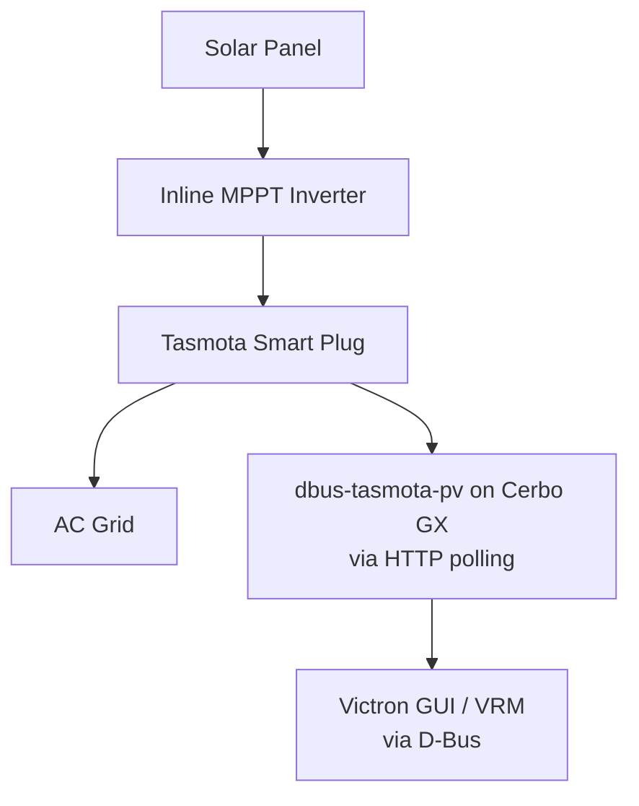

# dbus-tasmota-pv

[](https://github.com/victron-venus/dbus-tasmota-pv/actions/workflows/ci.yml)
[](https://opensource.org/licenses/MIT)
[](https://github.com/victron-venus/dbus-tasmota-pv/releases)
[](https://github.com/victron-venus/dbus-tasmota-pv/releases)
[](https://www.python.org/downloads/)
[](https://github.com/victronenergy/venus)
[](https://github.com/victron-venus/dbus-tasmota-pv)
[](https://github.com/victron-venus/dbus-tasmota-pv/stargazers)
[](https://github.com/victron-venus/dbus-tasmota-pv/network/members)
[](https://github.com/victron-venus/dbus-tasmota-pv/watchers)
[](https://github.com/victron-venus/dbus-tasmota-pv/graphs/contributors)
[](https://github.com/victron-venus/dbus-tasmota-pv/issues)
[](https://github.com/victron-venus/dbus-tasmota-pv/issues?q=is%3Aissue+is%3Aclosed)
[](https://github.com/victron-venus/dbus-tasmota-pv/pulls)
[](https://github.com/victron-venus/dbus-tasmota-pv/commits/main)
[](https://github.com/victron-venus/dbus-tasmota-pv)
[](https://github.com/victron-venus/dbus-tasmota-pv)
[](https://github.com/victron-venus/dbus-tasmota-pv/graphs/commit-activity)
[](https://github.com/victron-venus/dbus-tasmota-pv/pulls)
[](https://www.python.org/)
[](https://community.victronenergy.com/)

Venus OS driver for Tasmota smart plugs monitoring inline PV inverters.

## Overview

This script polls Tasmota smart plugs via HTTP and publishes power data to D-Bus as PV inverters. This allows Victron GX devices to see and display solar production from simple inline MPPT inverters that don't have native Victron integration.



## Features

- Polls Tasmota smart plugs every 2 seconds
- Reports power, voltage, current, and total energy
- Each plug appears as a separate PV inverter in Victron GUI
- Shows in VRM portal as PV production
- Minimal resource usage

## Configuration

Configure devices via command line arguments:

```bash
# Format: IP:INSTANCE
./dbus-tasmota-pv.py --devices 192.168.1.100:120 192.168.1.101:121
```

Or edit the service run script `/service/dbus-tasmota-pv/run`:

```bash
#!/bin/sh
cd /data/dbus-tasmota-pv
exec python3 dbus-tasmota-pv.py --devices 192.168.164.73:120 192.168.164.74:121
```

Parameters:
- IP address: Tasmota plug IP
- Instance: D-Bus device instance (unique number, 120-199 recommended)

## Requirements

- Venus OS (Cerbo GX, Venus GX, Raspberry Pi with Venus OS)
- Tasmota smart plugs with energy monitoring (e.g., Sonoff S31, Athom)
- Network access from GX device to Tasmota plugs

## Installation

### Option 1: SetupHelper (Recommended)

The easiest way to install is via [SetupHelper](https://github.com/kwindrem/SetupHelper) PackageManager:

1. **Install SetupHelper** (if not already installed):
   ```bash
   wget -qO - https://github.com/kwindrem/SetupHelper/archive/latest.tar.gz | tar -xzf - -C /data
   mv /data/SetupHelper-latest /data/SetupHelper
   /data/SetupHelper/setup
   ```

2. **Add package via GUI**:
   - Settings → PackageManager → Inactive packages → **new**
   - Package name: `dbus-tasmota-pv`
   - GitHub user: `victron-venus`
   - Branch/tag: `latest`
   - Proceed → Download → Install

3. **Done!** The package will automatically reinstall after Venus OS updates.

### How PackageManager Works

PackageManager discovers packages by scanning `/data/` for directories containing both a `version` file and a `setup` script. The `setup` script (sourced from this repo) is executed with the `INSTALL` action by SetupHelper, which:

- Creates the daemontools service under `/service/dbus-tasmota-pv/`
- Copies the Python script to `/data/dbus-tasmota-pv/`

The `gitHubInfo` file tells PackageManager where to download from:
```
victron-venus:latest
```

### Uninstall

Via PackageManager: Settings → PackageManager → dbus-tasmota-pv → Uninstall

Via CLI:
```bash
ssh Cerbo '/data/dbus-tasmota-pv/setup uninstall'
```

### Option 2: Manual Install

```bash
# Clone repository
cd dbus-tasmota-pv

# Edit dbus-tasmota-pv.py with your Tasmota IPs

# Deploy to Venus OS (assumes SSH host 'Cerbo' in ~/.ssh/config)
./deploy.sh
```

### Manual installation on Venus OS

```bash
# Copy files to Venus OS
scp -r dbus-tasmota-pv root@venus-ip:/data/

# SSH to Venus OS
ssh root@venus-ip

# Run installer
cd /data/dbus-tasmota-pv
./install.sh
```

## Service Management

```bash
# Check status
svstat /service/dbus-tasmota-pv

# Restart service
svc -t /service/dbus-tasmota-pv

# Stop service
svc -d /service/dbus-tasmota-pv

# Start service
svc -u /service/dbus-tasmota-pv

# View logs
tail -f /var/log/dbus-tasmota-pv/current | tai64nlocal
```

## Tasmota Setup

1. Flash your smart plug with Tasmota
2. Configure WiFi and connect to your network
3. Enable energy monitoring if not already enabled
4. Note the IP address (Settings → Information)
5. Test by accessing: `http://PLUG_IP/cm?cmnd=Status%208`

You should see JSON with ENERGY data including Power, Voltage, Current, Total.

## Troubleshooting

### Package not showing in PackageManager

PackageManager's `AddStoredPackages()` requires both a `version` file AND a `setup` script in `/data/dbus-tasmota-pv/`.

**Check**:
```bash
ls -la /data/dbus-tasmota-pv/version /data/dbus-tasmota-pv/setup
cat /data/dbus-tasmota-pv/gitHubInfo   # should show: victron-venus:latest
```

**Common issues**:
- `setup` file missing → PackageManager skips the directory silently
- `version` file missing or empty → PackageManager skips
- `gitHubInfo` missing → can't download updates

**Fix**:
```bash
# Copy missing files
scp setup gitHubInfo version root@cerbo:/data/dbus-tasmota-pv/
ssh root@cerbo "chmod +x /data/dbus-tasmota-pv/setup"

# Restart PackageManager to re-scan
svc -t /service/PackageManager
```

**Verify**:
```bash
tail -20 /var/log/PackageManager/current | grep dbus-tasmota-pv
# Should show: checking dbus-tasmota-pv / adding dbus-tasmota-pv
```

### Service not starting
```bash
# Check if service exists
ls -la /service/dbus-tasmota-pv/

# Check run script
cat /service/dbus-tasmota-pv/run

# Check for errors
cat /var/log/dbus-tasmota-pv/current | tai64nlocal | tail -20
```

### No data from Tasmota
```bash
# Test HTTP connection from Venus OS
curl 'http://192.168.164.73/cm?cmnd=Status%208'
```

### Service doesn't survive reboot

Venus OS uses daemontools for service management. Services in `/service/` start automatically on boot.

```bash
# Verify service symlink exists
ls -la /service/dbus-tasmota-pv

# Should point to /opt/victronenergy/service/dbus-tasmota-pv
# If missing, re-run installer:
cd /data/dbus-tasmota-pv
./install.sh
```

## D-Bus Paths

The script publishes these D-Bus paths for each inverter:

| Path | Description |
|------|-------------|
| `/Ac/Power` | Total AC power (W) |
| `/Ac/L1/Power` | L1 power (W) |
| `/Ac/L1/Voltage` | L1 voltage (V) |
| `/Ac/L1/Current` | L1 current (A) |
| `/Ac/Energy/Forward` | Total energy produced (kWh) |
| `/Position` | 0 = AC Input (grid side) |

## Related Projects

This project is part of the Victron Venus OS integration suite:

| Project | Description |
|---------|-------------|
| [inverter-control](https://github.com/victron-venus/inverter-control) | Advanced ESS external control system with grid-zero targeting |
| [inverter-dashboard](https://github.com/victron-venus/inverter-dashboard) | Real-time web dashboard (Python/FastAPI) via MQTT |
| [inverter-dashboard-go](https://github.com/victron-venus/inverter-dashboard-go) | High-performance Go rewrite of the web dashboard |
| [inverter-desktop](https://github.com/victron-venus/inverter-desktop) | Native desktop application (Rust/Tauri) for system monitoring |
| [dbus-mqtt-battery](https://github.com/victron-venus/dbus-mqtt-battery) | MQTT to D-Bus bridge for JBD BMS battery integration |
| **dbus-tasmota-pv** (this) | Tasmota smart plug integration as a PV inverter on D-Bus |
| [esphome-jbd-bms-mqtt](https://github.com/victron-venus/esphome-jbd-bms-mqtt) | ESP32 Bluetooth monitor for JBD BMS batteries |
| [inverter-monitoring](https://github.com/victron-venus/inverter-monitoring) | TIG (Telegraf, InfluxDB, Grafana) monitoring stack |
| [terraform-github-victron](https://github.com/4alvit/terraform-github-victron) | Infrastructure as Code for the GitHub organization |

## License

MIT License

## Contributing

1. Fork the repository
2. Create a feature branch (`git checkout -b feature-name`)
3. Commit your changes
4. Push to the branch (`git push origin feature-name`)
5. Create a Pull Request

## Support

For issues specific to:
- **Tasmota devices**: Check device is on same network and HTTP API accessible
- **D-Bus integration**: Verify D-Bus service registration
- **Power readings**: Ensure energy monitoring enabled in Tasmota
- **This project**: Open an issue in this repository

**Note:** This is a community project and is not affiliated with Victron Energy.
