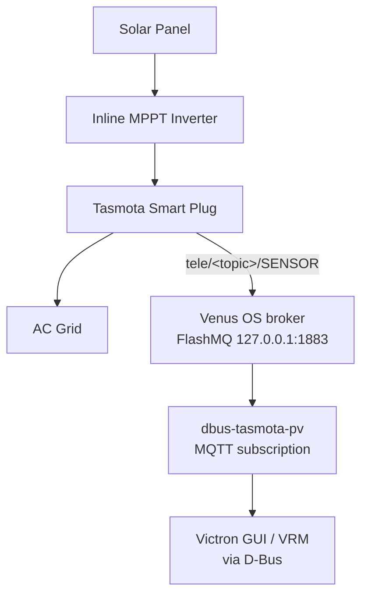

# dbus-tasmota-pv

[](https://github.com/victron-venus/dbus-tasmota-pv/actions/workflows/ci.yml)
[](https://opensource.org/licenses/MIT)
[](https://github.com/victron-venus/dbus-tasmota-pv/releases)
[](https://github.com/victron-venus/dbus-tasmota-pv/releases)
[](https://www.python.org/downloads/)
[](https://github.com/victronenergy/venus)
[](https://github.com/victron-venus/dbus-tasmota-pv)
[](https://github.com/victron-venus/dbus-tasmota-pv/stargazers)
[](https://github.com/victron-venus/dbus-tasmota-pv/network/members)
[](https://github.com/victron-venus/dbus-tasmota-pv/watchers)
[](https://github.com/victron-venus/dbus-tasmota-pv/graphs/contributors)
[](https://github.com/victron-venus/dbus-tasmota-pv/issues)
[](https://github.com/victron-venus/dbus-tasmota-pv/issues?q=is%3Aissue+is%3Aclosed)
[](https://github.com/victron-venus/dbus-tasmota-pv/pulls)
[](https://github.com/victron-venus/dbus-tasmota-pv/commits/main)
[](https://github.com/victron-venus/dbus-tasmota-pv)
[](https://github.com/victron-venus/dbus-tasmota-pv)
[](https://github.com/victron-venus/dbus-tasmota-pv/graphs/commit-activity)
[](https://github.com/victron-venus/dbus-tasmota-pv/pulls)
[](https://www.python.org/)
[](https://community.victronenergy.com/)

Venus OS driver for Tasmota smart plugs monitoring inline PV inverters.

---

## Release Channels & CI/CD

This repository provides automated build archives for Victron Venus OS installations:

- **Stable Releases**: Tagged as `vX.Y.Z` (e.g., `v1.0.0`). Contains packaged Venus OS installer tarballs (`dbus-tasmota-pv-*.tar.gz`).
- **Pre-releases**: Tagged with `-rc.N` or `-beta.N`. Automatically flagged as Pre-release on GitHub Releases.
- **Nightly Builds**: Built daily at 02:00 UTC. Generates a fresh `dbus-tasmota-pv-nightly.tar.gz` package published to the **[Nightly Build Release](https://github.com/victron-venus/dbus-tasmota-pv/releases/tag/nightly)**.

---

## Completed Features

- ✅ **CI/CD Releases & Nightly Builds**: Installer packaging workflows configured for automated releases

---

## Overview

This script subscribes to MQTT telemetry pushed by Tasmota smart plugs and publishes power data to D-Bus as PV inverters. This allows Victron GX devices to see and display solar production from simple inline MPPT inverters that don't have native Victron integration.


```mermaid
flowchart TB
    SP[Solar Panel] --> MPPT[Inline MPPT Inverter]
    MPPT --> TP[Tasmota Smart Plug]
    TP --> GRID[AC Grid]
    TP -- tele/&lt;topic&gt;/SENSOR --> BROKER[Venus OS broker<br/>FlashMQ 127.0.0.1:1883]
    BROKER --> SCRIPT[dbus-tasmota-pv<br/>MQTT subscription]
    SCRIPT --> GUI[Victron GUI / VRM<br/>via D-Bus]
```

## Features

- Push-based: plugs publish telemetry, no HTTP polling
- Reports power, voltage, current, and total energy
- Each plug appears as a separate PV inverter in Victron GUI
- Shows in VRM portal as PV production
- Auto-reconnect and staleness detection (offline after 90s without data)
- Uses paho-mqtt preinstalled on Venus OS 3.x (no pip needed)

## Device Discovery

No configuration needed. The service subscribes to the wildcard MQTT topic
`tele/+/SENSOR`, and every Tasmota plug whose telemetry it sees is
automatically registered as a PV inverter on the D-Bus. Add a new plug
(make sure its Tasmota `Topic` is unique and it publishes to the broker) and
it appears on its own within one telemetry interval.

Each discovered plug gets a deterministic D-Bus instance derived from its
MQTT topic, so service names survive restarts. The `/Serial` path equals
the Tasmota topic (`TASMOTA-<topic>`), which keeps device identity stable
in the GUI and VRM.

Broker defaults to `127.0.0.1:1883` (the Venus OS broker); override with `--mqtt-host` / `--mqtt-port` when running off-device:

```bash
./dbus-tasmota-pv.py --mqtt-host 192.168.160.150
```

## Requirements

- Venus OS (Cerbo GX, Venus GX, Raspberry Pi with Venus OS)
- Tasmota smart plugs **with energy monitoring** publishing to the Venus OS
  broker (e.g., Sonoff S31, Athom). Plugs without an ENERGY block are ignored.
- paho-mqtt (preinstalled on Venus OS 3.x)

## Installation

### Option 1: SetupHelper (Recommended)

The easiest way to install is via [SetupHelper](https://github.com/kwindrem/SetupHelper) PackageManager:

1. **Install SetupHelper** (if not already installed):
   ```bash
   wget -qO - https://github.com/kwindrem/SetupHelper/archive/latest.tar.gz | tar -xzf - -C /data
   mv /data/SetupHelper-latest /data/SetupHelper
   /data/SetupHelper/setup
   ```

2. **Add package via GUI**:
   - Settings → PackageManager → Inactive packages → **new**
   - Package name: `dbus-tasmota-pv`
   - GitHub user: `victron-venus`
   - Branch/tag: `latest`
   - Proceed → Download → Install

3. **Done!** The package will automatically reinstall after Venus OS updates.

### How PackageManager Works

PackageManager discovers packages by scanning `/data/` for directories containing both a `version` file and a `setup` script. The `setup` script (sourced from this repo) is executed with the `INSTALL` action by SetupHelper, which:

- Creates the daemontools service under `/service/dbus-tasmota-pv/`
- Copies the Python script to `/data/dbus-tasmota-pv/`

The `gitHubInfo` file tells PackageManager where to download from:
```
victron-venus:latest
```

### Uninstall

Via PackageManager: Settings → PackageManager → dbus-tasmota-pv → Uninstall

Via CLI:
```bash
ssh Cerbo '/data/dbus-tasmota-pv/setup uninstall'
```

### Option 2: Manual Install

```bash
# Clone repository
cd dbus-tasmota-pv

# Edit dbus-tasmota-pv.py with your Tasmota IPs

# Deploy to Venus OS (assumes SSH host 'Cerbo' in ~/.ssh/config)
./deploy.sh
```

### Manual installation on Venus OS

```bash
# Copy files to Venus OS
scp -r dbus-tasmota-pv root@venus-ip:/data/

# SSH to Venus OS
ssh root@venus-ip

# Run installer
cd /data/dbus-tasmota-pv
./install.sh
```

## Service Management

```bash
# Check status
svstat /service/dbus-tasmota-pv

# Restart service
svc -t /service/dbus-tasmota-pv

# Stop service
svc -d /service/dbus-tasmota-pv

# Start service
svc -u /service/dbus-tasmota-pv

# View logs
tail -f /var/log/dbus-tasmota-pv/current | tai64nlocal
```

## Flashing Tasmota Firmware

Plugs must run [Tasmota](https://tasmota.github.io/docs/) with **energy monitoring**
enabled — the driver only reacts to the `ENERGY` block in telemetry. Three ways to
get there, easiest first:

**1. Buy pre-flashed hardware** — vendors such as
[Athom](https://www.athom.tech/) sell smart plugs with Tasmota preinstalled
(energy monitoring included). Zero flashing work.

**2. Web installer** — requires opening the plug and wiring a USB-TTL adapter
(**3.3 V logic**, 5 V will damage the chip):

1. Wire the adapter: `VCC → 3V3`, `GND → GND`, board `RX → TX`, board `TX → RX`
2. Hold `GPIO0` to `GND` while applying power to enter flash mode
3. Open https://tasmota.github.io/install/ in Chrome or Edge, connect, and
   install the latest `tasmota.bin` release build

Same job from the CLI with esptool:

```bash
esptool.py --port /dev/ttyUSB0 --baud 115200 write_flash -fs 1MB -fm dout -ff 40m tasmota.bin
```

**3. No-teardown methods** for Tuya-based plugs:
[cloudcutter](https://github.com/tuya-cloudcutter/tuya-cloudcutter) pushes
Tasmota over the network by exploiting the vendor cloud handshake.

### First boot

1. Join the plug's Wi-Fi access point (`tasmota-XXXXXX`) and set your
   SSID/password at `http://192.168.4.1`.
2. If power readings stay empty, apply the correct pinout: find your plug model
   in the [device template repository](https://templates.blakadder.com/) and
   paste its Template string into Tasmota.
3. Continue with [Tasmota Setup](#tasmota-setup) below to point it at the Cerbo
   broker.

## Tasmota Setup

Point each plug at the Venus OS broker and give it a unique topic. **This step
is what makes the whole chain work**: the dbus-tasmota-pv driver subscribes on
the Cerbo itself (`127.0.0.1:1883`) and discovers plugs purely from
`tele/+/SENSOR` traffic. A plug publishing to any other broker — Home
Assistant's included — is invisible to the driver and never becomes a PV
inverter. One broker, one telemetry stream: consumed by the driver
(D-Bus → GUI/VRM) and mirrored to Home Assistant via the
[MQTT bridge](#home-assistant-integration).

```bash
# From any machine on the LAN (GX_IP = your Venus OS device)
curl 'http://PLUG_IP/cm?cmnd=Backlog%20MqttHost%20GX_IP%3B%20MqttPort%201883%3B%20Topic%20tasmota_120%3B%20SetOption19%200%3B%20TelePeriod%2060%3B%20SensorRetain%201'
```

- `Topic tasmota_120`: unique topic per plug; must match the driver config
- `SetOption19 0`: disable Home Assistant discovery publishing
- `TelePeriod 60`: push telemetry every 60 seconds
- `SensorRetain 1`: broker keeps last reading (driver gets data immediately after restart)

## Home Assistant Integration

Home Assistant consumes the **same** telemetry stream by bridging the Cerbo's
broker over MQTT. One source of truth: no duplicate polling, and VRM, the
Victron GUI, and HA all see identical plug state.

### Why bridge instead of pointing plugs at two brokers?

- The driver subscribes **locally on the Cerbo** (`127.0.0.1:1883`); plugs aimed
  at HA's broker directly would break the D-Bus side.
- The mosquitto bridge mirrors topics into HA without touching plug config.
- Commands flow back along one path (`cmnd/# out`), so HA can switch plugs
  without a second write route that could disagree with the Cerbo.
- The Cerbo broker accepts anonymous connections from the LAN, so the bridge
  needs no credentials — keep the network firewalled accordingly.

### 1. Install the Mosquitto broker add-on

In Home Assistant: Settings → Add-ons → **Mosquitto broker** → install & start.

### 2. Create the bridge configuration

Create `mosquitto/victron.conf` inside HA's `share` folder — via Samba
(`\\homeassistant\share\mosquitto\victron.conf`) or the Terminal add-on
(`/share/mosquitto/victron.conf`):

```conf
# Bridge the Cerbo GX broker into Home Assistant.
#
# Direction is relative to HA:
#   in  = HA receives these topics from the Cerbo
#   out = HA publishes these topics to the Cerbo

connection victron
address 192.168.160.150:1883

# Victron native MQTT-API: notifications in; readings and writes out.
# Everything is prefixed with victron/ locally to avoid clashing with HA topics.
topic N/# in 0 victron/
topic R/# out 0 victron/
topic W/# out 0 victron/

# Tasmota telemetry and discovery payloads relayed by the Cerbo (one-way, read-only):
topic tasmota/# in 0
topic tele/# in 0
topic stat/# in 0
topic homeassistant/# in 0

# Plug switching commands from HA down through the Cerbo (one-way, write-only):
topic cmnd/# out 0
```

Replace `192.168.160.150` with your GX device's IP address.

### 3. Activate the customization

Mosquitto add-on → Configuration tab:

```yaml
customize:
  active: true
  folder: mosquitto
```

Save and restart the add-on. Every `.conf` file under `/share/mosquitto/` is now
included by the broker.

### 4. Verify

From the HA Terminal add-on:

```bash
mosquitto_sub -h core-mosquitto -t 'tele/+/SENSOR' -C 1   # plug telemetry arrives
mosquitto_sub -h core-mosquitto -t 'victron/N/#' -C 1     # Victron notifications arrive
mosquitto_sub -h core-mosquitto -t 'homeassistant/#' -v   # discovery payloads arrive
```

### What you get in Home Assistant

| Topics | Meaning |
|--------|---------|
| `tele/<topic>/SENSOR` | live power / voltage / current / energy per plug |
| `stat/<topic>/RESULT` | command responses from the plugs |
| `cmnd/<topic>/...` | writable controls (`POWER`, `TelePeriod`, ...) |
| `victron/N/<gx-serial>/...` | Victron GX notifications |
| `homeassistant/#` | HA auto-discovery payloads forwarded from the plugs |

With `SetOption19 1` each plug publishes HA discovery payloads; they travel over
the bridge and the plug appears in HA automatically as a power sensor plus a
switchable outlet. This repo recommends `SetOption19 0` for a clean Cerbo-only
setup — then you get the raw topics only and wire entities yourself (e.g. an
MQTT sensor on `tele/<topic>/SENSOR` at JSON path `ENERGY.Power`).

## Troubleshooting

### Package not showing in PackageManager

PackageManager's `AddStoredPackages()` requires both a `version` file AND a `setup` script in `/data/dbus-tasmota-pv/`.

**Check**:
```bash
ls -la /data/dbus-tasmota-pv/version /data/dbus-tasmota-pv/setup
cat /data/dbus-tasmota-pv/gitHubInfo   # should show: victron-venus:latest
```

**Common issues**:
- `setup` file missing → PackageManager skips the directory silently
- `version` file missing or empty → PackageManager skips
- `gitHubInfo` missing → can't download updates

**Fix**:
```bash
# Copy missing files
scp setup gitHubInfo version root@cerbo:/data/dbus-tasmota-pv/
ssh root@cerbo "chmod +x /data/dbus-tasmota-pv/setup"

# Restart PackageManager to re-scan
svc -t /service/PackageManager
```

**Verify**:
```bash
tail -20 /var/log/PackageManager/current | grep dbus-tasmota-pv
# Should show: checking dbus-tasmota-pv / adding dbus-tasmota-pv
```

### Service not starting
```bash
# Check if service exists
ls -la /service/dbus-tasmota-pv/

# Check run script
cat /service/dbus-tasmota-pv/run

# Check for errors
cat /var/log/dbus-tasmota-pv/current | tai64nlocal | tail -20
```

### No data from Tasmota
```bash
# Check telemetry arrives on the Venus OS broker
mosquitto_sub -h 127.0.0.1 -t 'tele/+/SENSOR' -C 1

# Check plug-side MQTT config
curl 'http://PLUG_IP/cm?cmnd=Status%203'
```

### Service doesn't survive reboot

Venus OS uses daemontools for service management. Services in `/service/` start automatically on boot.

```bash
# Verify service symlink exists
ls -la /service/dbus-tasmota-pv

# Should point to /opt/victronenergy/service/dbus-tasmota-pv
# If missing, re-run installer:
cd /data/dbus-tasmota-pv
./install.sh
```

## D-Bus Paths

The script publishes these D-Bus paths for each inverter:

| Path | Description |
|------|-------------|
| `/Ac/Power` | Total AC power (W) |
| `/Ac/L1/Power` | L1 power (W) |
| `/Ac/L1/Voltage` | L1 voltage (V) |
| `/Ac/L1/Current` | L1 current (A) |
| `/Ac/Energy/Forward` | Total energy produced (kWh) |
| `/Position` | 0 = AC Input (grid side) |

## Related Projects

This project is part of the Victron Venus OS integration suite:

| Project | Description |
|---------|-------------|
| [inverter-control](https://github.com/victron-venus/inverter-control) | Advanced ESS external control system with grid-zero targeting |
| [inverter-dashboard](https://github.com/victron-venus/inverter-dashboard) | Real-time web dashboard (Python/FastAPI) via MQTT |
| [inverter-dashboard-go](https://github.com/victron-venus/inverter-dashboard-go) | High-performance Go rewrite of the web dashboard |
| [inverter-desktop](https://github.com/victron-venus/inverter-desktop) | Native desktop application (Rust/Tauri) for system monitoring |
| [dbus-mqtt-battery](https://github.com/victron-venus/dbus-mqtt-battery) | MQTT to D-Bus bridge for JBD BMS battery integration |
| **dbus-tasmota-pv** (this) | Tasmota smart plug integration as a PV inverter on D-Bus |
| [esphome-jbd-bms-mqtt](https://github.com/victron-venus/esphome-jbd-bms-mqtt) | ESP32 Bluetooth monitor for JBD BMS batteries |
| [inverter-monitoring](https://github.com/victron-venus/inverter-monitoring) | TIG (Telegraf, InfluxDB, Grafana) monitoring stack |
| [terraform-github-victron](https://github.com/4alvit/terraform-github-victron) | Infrastructure as Code for the GitHub organization |

## License

MIT License

## Contributing

1. Fork the repository
2. Create a feature branch (`git checkout -b feature-name`)
3. Commit your changes
4. Push to the branch (`git push origin feature-name`)
5. Create a Pull Request

## Support

For issues specific to:
- **Tasmota devices**: Check device is on same network and MQTT broker reachable
- **D-Bus integration**: Verify D-Bus service registration
- **Power readings**: Ensure energy monitoring enabled in Tasmota
- **This project**: Open an issue in this repository

**Note:** This is a community project and is not affiliated with Victron Energy.
